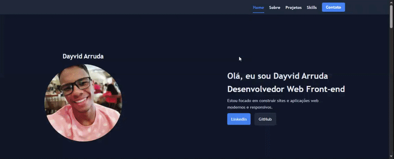

# 💻 Meu Portfólio Profissional

Bem-vindo ao repositório do meu portfólio pessoal! Este projeto foi desenvolvido para centralizar meus principais projetos, demonstrar minhas habilidades técnicas e facilitar o contato com recrutadores e outros desenvolvedores.

> **Link para o site:** [Acesse aqui](https://portfolio-one-bice-nw3ac3p1kx.vercel.app/)

## 🎨 Layout

## 👤 Sobre Mim
Sou estudante do primeiro ano de faculdade em Recife-PE e entusiasta do desenvolvimento Frontend. Atualmente, estou focado em criar interfaces modernas, responsivas e intuitivas utilizando as melhores práticas de HTML, CSS e JavaScript.

## 🛠️ Tecnologias Utilizadas
Neste projeto, utilizei:
- **HTML5**: Estruturação semântica e acessível.
- **CSS3**: Estilização avançada com Flexbox e Grid.
- **JavaScript**: Lógica para interatividade e animações.
- **Git/GitHub**: Controle de versão e deploy contínuo.

## 📱 Contato
Se você gostou do meu trabalho ou quer trocar uma ideia sobre tecnologia, sinta-se à vontade para me chamar:

- 
- 
- 

---
Desenvolvido por [Dayvid Arruda](https://github.com/DayvidArruda)
